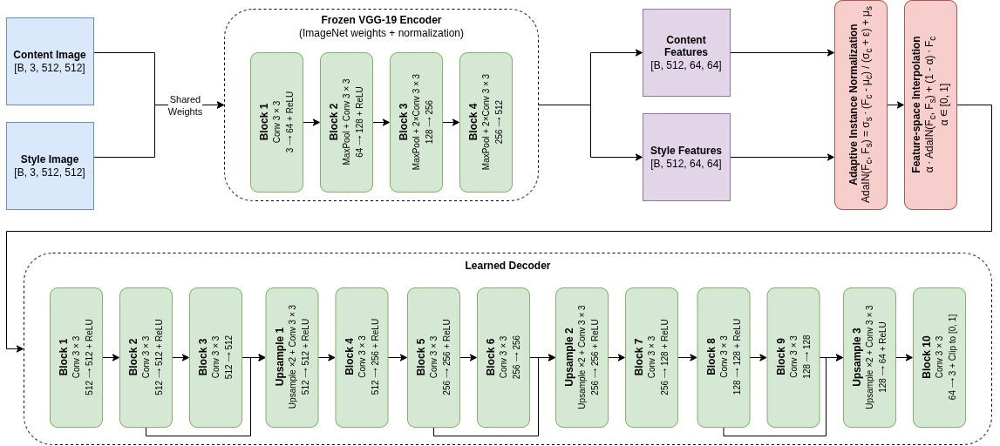

# stylyze

**Author:** Charlie Clark \
**Date Started:** 2026-09-12

## Contents

1. [What is stylyze](#what-is-stylyze)
2. [How does stylyze work?](#how-does-stylyze-work)
   - [The idea](#the-idea)
   - [Architecture](#architecture)
   - [Style strength](#style-strength)
   - [Training](#training)
   - [Serving it](#serving-it)
3. [Citations](#citations)

## What is stylyze?

stylyze is a neural style transfer (NST) application. The user uploads both a real-world photograph (the content image) and a painting (the style image). Using a deep neural architecture, stylyze will transfer the artistic style from the uploaded painting to the user's real-world photograph. stylyze can do this without ever having previously seen either the content image or the style image.

## How does stylyze work?

stylyze is an implementation of [Adaptive Instance Normalization](https://arxiv.org/abs/1703.06868)
(Huang & Belongie, 2017), trained from scratch on COCO and WikiArt.

### The idea

A convolutional network trained on natural images ends up storing style (palette, brush) texture and contrast (in the *statistics* of its feature maps) while content (what is actually depicted) lives in their spatial arrangement. AdaIN uses this directly: normalize the content image's features to zero mean and unit variance per channel, then rescale them using the mean and standard deviation of the style image's features. The arrangement survives, the statistics are replaced.

That operation has no learned parameters, which is what makes the style *arbitrary*. Earlier fast style transfer methods trained one network per style. stylyze has never seen your painting before and does not need to, the style image is an input, not a weight.

### Architecture



**Encoder.** ImageNet-pretrained VGG-19, truncated at `relu4_1`. Frozen throughout: it is a fixed measuring instrument, not something being learned.

**AdaIN [1].** Normalizes content features and rescales them with the style's per-channel mean and standard deviation. Parameter-free.

**Decoder.** Mirrors the encoder in reverse: 3×3 convolutions with reflection padding, three nearest-neighbour 2× upsamples, and residual blocks at 512, 256 and 128 channels. Reflection padding avoids the border artifacts that zero padding leaves around the frame, and the output is deliberately unbounded (no sigmoid), so activations cannot saturate during training.

Only the decoder is trained. The task it learns is narrow and well-posed: invert AdaIN's output back into an image.

### Style strength

The `alpha` slider interpolates in *feature space*, before decoding:

```
target = alpha · AdaIN(content, style) + (1 - alpha) · content_features
```

At `alpha = 0` the decoder reconstructs the photograph, at `1` it applies the style fully, and in between it produces genuinely intermediate stylizations. Blending the decoded pixels instead would merely cross-fade two finished images, which looks like a dissolve rather than a weaker style.

### Training

| | |
|---|---|
| Content images | COCO `train2017` [2] |
| Style images | WikiArt [3], randomly paired with content |
| Preprocessing | shorter side resized to 512, random 256×256 crop |
| Optimizer | Adam, learning rate 1e-4 (1e-3 makes activations explode within a few steps) |
| Batch size | 8 |
| Epochs | 30 |
| Trained parameters | the decoder only |

Four losses, all measured through the same frozen encoder:

- **Content** (λ=1) - MSE between the output's `relu4_1` features and the AdaIN target. Note the target is AdaIN's output, not the content image's features: the decoder is being taught to invert AdaIN, not to reproduce the photograph.
- **Style** (λ=10) - MSE on per-channel means and standard deviations at `relu1_1` through `relu4_1`. Matching statistics at four depths captures both fine texture and broad palette.
- **Identity** (λ=1) - L1 reconstruction loss for stylizing an image with *itself*, which should return it unchanged. A cheap, strong signal that keeps the decoder honest.
- **Total variation** (λ=1) - penalizes differences between neighboring pixels, suppressing the checkerboard artifacts that upsampling tends to produce.

### Serving it

The trained model is exported to ONNX and served with ONNX Runtime on CPU, which is about 20% faster than PyTorch here and shrinks the backend image from 1.5+ GB to ~700 MB. The serving container needs no deep learning framework at all, just a ~70 MB graph.

A FastAPI backend and an Angular frontend run behind nginx and Caddy on a single EC2 instance. Uploads are resized to a 512-pixel shorter side and cropped to a multiple of 8, since the decoder's three 2× upsamples fix the output to that grid. One image takes roughly 10 seconds on two vCPUs, so the API serves a single inference at a time and sheds bursts rather than queueing them indefinitely.

## Citations

[1] Huang, X. and Belongie, S. (2017). Arbitrary Style Transfer in Real-time with Adaptive Instance Normalization. *arXiv*. [https://doi.org/10.48550/arXiv.1703.06868](https://doi.org/10.48550/arXiv.1703.06868).

[2] Lin, T., Maire, M., Belongie, S., Bourdev, L., Girshick, R., Hays, J., Perona, P., Ramanan, D., Zitnick, C.L., Dollár, P. (2014). Microsoft COCO: Common Objects in Context. *arXiv.* [https://doi.org/10.48550/arXiv.1405.0312](https://doi.org/10.48550/arXiv.1405.0312).

[3] Tan, W.R., Chan, C.S., Aguirre, H.E., Tanaka, K. (2019). Improved ArtGAN for Conditional Synthesis of Natural Image and Artwork. *IEEE Transactions of Image Processing,* 28(1), 394-409. [https://doi.org/10.1109/TIP.2018.2866698](https://doi.org/10.1109/TIP.2018.2866698).